# Restaurant Table Reservation System

A full-stack web application that allows for managing table reservations at restaurants. The system is designed so that both customers and administrators can interact securely and easily, using **Spring Boot** for the backend, **Angular** for the frontend, **MySQL** for data storage, and **Tailwind CSS** for a modern, responsive design.

---

## Table of Contents

- [Features](#features)
- [Technologies Used](#technologies-used)
- [Entity-Relationship Model](#entity-relationship-model)
- [Description of the Model](#description-of-the-model)
- [Project Structure](#project-structure)
- [Installation and Setup](#installation-and-setup)
- [License](#license)
- [Contact](#contact)

---

## Features

- **User Management**
  - Registration, authentication, and profile management.
  - Password recovery.
  - User roles (e.g., CUSTOMER and ADMIN).

- **Restaurant Management**
  - Creation, editing, and viewing of restaurant information.
  - Table allocation and definition of operating hours.

- **Table Management**
  - Table setup with attributes like number and capacity.
  - Association of tables to restaurants.

- **Schedule Management**
  - Definition of time slots when the restaurant is operational.
  - Configuration of available reservations by time slot.

- **Reservation System**
  - Creation, modification, and cancellation of reservations.
  - Real-time availability check.
  - Notifications and reservation confirmation.

- **Security**
  - JSON Web Token (JWT) based authentication.
  - Role-based access control.
  - Endpoint protection and encryption of sensitive data.

- **User Interface**
  - Responsive application developed with Angular.
  - Modern, adaptive design using Tailwind CSS.

---

## Technologies Used

- **Backend:**
  - **Java 11+**
  - **Spring Boot:** Facilitates the creation of enterprise applications with minimal configuration.
  - **Spring Data JPA:** Manages persistence and data access in MySQL.
  - **Spring Security:** Handles and controls security in the application.
  - **JWT (JSON Web Tokens):** Authentication and session management.

- **Frontend:**
  - **Angular:** Framework for developing dynamic web interfaces.
  - **Tailwind CSS:** CSS framework for a modern, responsive design.

- **Database:**
  - **MySQL:** Relational database for persistent storage.

- **Utilities:**
  - **Maven:** Dependency management and project lifecycle for the backend.
  - **Node.js & npm:** Dependency and script management for the Angular project.
  - **Docker (Optional):** For containerization and deployment of the application.

---

## Entity-Relationship Model

Here is a simplified entity-relationship model that defines the main structure of the database:

```mermaid
erDiagram
    USER {
        int id PK "Primary key"
        string name
        string email
        string password
        string role "e.g., ADMIN, CUSTOMER"
    }
    
    RESTAURANT {
        int id PK "Primary key"
        string name
        string address
        string phone
        string description
    }
    
    AREA {
        int id PK "Primary key"
        string name "Area name"
        string description
        int restaurant_id FK "Foreign key to RESTAURANT"
    }
    
    TABLE {
        int id PK "Primary key"
        int number "Table number"
        int capacity "Number of people"
        int area_id FK "Foreign key to AREA"
    }
    
    SCHEDULE {
        int id PK "Primary key"
        time opening_time
        time closing_time
        int restaurant_id FK "Foreign key to RESTAURANT"
    }
    
    RESERVATION {
        int id PK "Primary key"
        datetime reservation_time "Date and time of the reservation"
        int user_id FK "Foreign key to USER"
        int restaurant_id FK "Foreign key to RESTAURANT"
        int table_id FK "Foreign key to TABLE"
        string status "e.g., PENDING, CONFIRMED, CANCELLED"
    }
    
    REVIEW {
        int id PK "Primary key"
        int user_id FK "Foreign key to USER"
        int restaurant_id FK "Foreign key to RESTAURANT"
        int rating "Rating (e.g., 1-5)"
        string comment "Review comment"
        datetime review_date "Date of the review"
    }
    
    PAYMENT {
        int id PK "Primary key"
        int reservation_id FK "Foreign key to RESERVATION"
        decimal amount "Payment amount"
        string status "e.g., PAID, PENDING, FAILED"
        datetime payment_date "Date of payment"
    }
    
    PROMOTION {
        int id PK "Primary key"
        int restaurant_id FK "Foreign key to RESTAURANT"
        string title "Promotion title"
        string description "Promotion description"
        decimal discount "Discount percentage or fixed amount"
        datetime start_date "Promotion start date"
        datetime end_date "Promotion end date"
    }
    
    USER ||--o{ RESERVATION : "makes"
    RESTAURANT ||--o{ SCHEDULE : "defines"
    RESTAURANT ||--o{ RESERVATION : "manages"
    TABLE ||--o{ RESERVATION : "is reserved at"
    RESTAURANT ||--o{ REVIEW : "receives"
    USER ||--o{ REVIEW : "writes"
    RESERVATION ||--|| PAYMENT : "has"
    RESTAURANT ||--o{ PROMOTION : "offers"
    RESTAURANT ||--o{ AREA : "includes"
    AREA ||--o{ TABLE : "contains"

```



## Description of the Model

- **User:** Represents the customers and administrators of the system. Each user can make multiple reservations.

- **Restaurant:** Contains the essential information of each restaurant. Each restaurant can have several tables, define different schedules, and offer promotions.

- **Table:** Tables belong to a restaurant and are characterized by their number and capacity. Each table is assigned to a specific area within the restaurant.

- **Schedule:** Defines the periods during which the restaurant operates, allowing the management of reservation availability.

- **Reservation:** Records each reservation made, linking the user, the restaurant, and the table. The reservation status indicates whether it is pending, confirmed, or canceled.

- **Review:** Represents the reviews or feedback left by users regarding their dining experience. Each review is associated with a specific user and restaurant, and it includes a rating, a comment, and the date when the review was posted.

- **Payment:** Represents the payment or billing details associated with a reservation. Each payment is linked to a reservation and includes attributes such as the amount, status (e.g., PAID, PENDING, FAILED), and the payment date.

- **Promotion:** Represents promotions or special offers available at a restaurant. Each promotion is associated with a restaurant and includes a title, description, discount information (either a percentage or a fixed amount), and the promotion's start and end dates.

- **Area:** Represents different areas or sections within a restaurant. Each area is linked to a restaurant and is used to organize tables by location (e.g., indoor, outdoor, terrace). This helps in managing seating arrangements and improving the reservation process.


## Project Structure

```plaintext
reservation-system/
│── backend/
│   ├── src/
│   │   ├── main/
│   │   │   ├── java/com/reservations/
│   │   │   │   ├── controllers/
│   │   │   │   ├── models/
│   │   │   │   ├── repositories/
│   │   │   │   ├── services/
│   │   │   ├── resources/
│   │   ├── test/
│   ├── pom.xml
│
│── frontend/
│   ├── src/
│   │   ├── app/
│   │   │   ├── components/
│   │   │   ├── services/
│   │   │   ├── views/
│   ├── angular.json
│   ├── package.json
│
│── docker-compose.yml (Optional)
│── README.md
```


